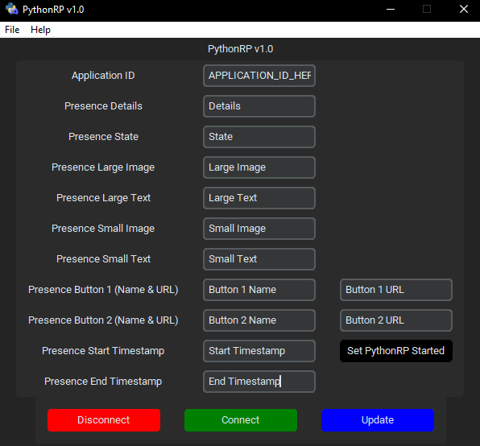

# PythonRP

PythonRP is a CustomTkinter / Tkinter application written in Python using pypresence.
Creating custom rich presences to display on your profiles.

I just made this because I'm not sure people really make these in Python often / ever had. 
And it was a bit fun to make. (Besides the  code issues, etc.)

### v1.0 UI



## Features

- Saving & Loading Presets
- Auto saves after each application close
- Rich Presences with buttons included.
- Whatever else that counts as a feature.

## Installation

Go to the [Releases](https://github.com/ItzBlueBerries/PythonRP/releases).

Download the latest release.

Run the `.exe` file in the folder after extracting it.

Fill out the information you want to fill out in the GUI application and there you go!

**NOTE: You'll have to know how to create a discord application and copying its ID. 
Look it up on Google or YouTube.**

## Building from source

*Requirements*
- Simply install them via the requirements.txt.
- `pip install -r requirements.txt`

After that, simply run `python main.py`. Make sure the `icon.ico` is in the directory.

If you want to build the application to GUI, use pyinstaller.

```shell
pyinstaller --noconfirm --onedir --windowed --icon "icon.ico" --version-file "version_info.txt" --add-data "customtkinter_package_path_here"  main.py
```

If any of this doesn't work / you don't get it, you can do what I used instead but I did it because I liked it.
Use the GUI version, [Auto Py To Exe](https://pypi.org/project/auto-py-to-exe/).

## Other

This application was created by FruitsyOG.

- Credits to [TomSchimansky](https://github.com/TomSchimansky) for CustomTkinter. (Nicer ui)
- Credits to [qwertyquerty](https://pypi.org/project/pypresence/) for Pypresence. (Operates this thing)
